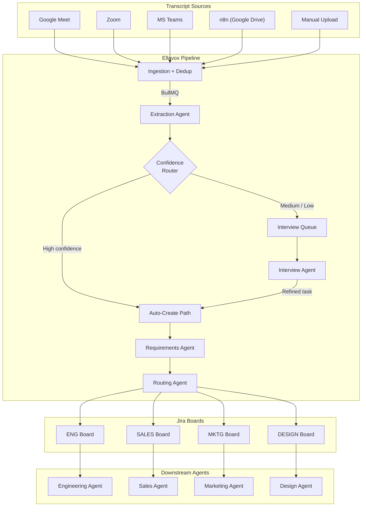

# Ellavox

**Close the meeting-to-action loop. Automatically.**

Every meeting generates action items. Most of them die in notes, chat threads, and shared docs that nobody re-reads. The gap between "someone said we should do X" and "X is a tracked, assigned Jira card" is slow, lossy, and manual. Ellavox eliminates that gap.

Transcripts go in. Structured, routed Jira cards come out. A human only steps in when the AI isn't confident enough to act alone.

---

## Manifest: Unlocking Autonomy Through Collaboration

Autonomous agents hit the same wall every time: they stall on ambiguity they can't resolve alone. The agent either blocks the pipeline waiting for input, or guesses and produces garbage a human has to fix. Both outcomes are slow. Neither scales.

Ellavox takes a different position: **the fastest path to autonomous agents runs through structured human collaboration, not around it.**

The bottleneck in the agentic loop isn't capability — it's context. Models are excellent at extraction, prioritization, and spec writing. What they can't do is know who *actually* owns a deliverable, what "soon" means to *this* team, or whether a vague discussion point was a real commitment. That context lives in people's heads, not in transcripts.

**Confidence-routed collaboration** solves this without making humans a bottleneck:

| Confidence | What Happens | Human Role |
|------------|-------------|------------|
| **High** | Agent acts autonomously — extracts, specs, routes, creates the Jira card | None |
| **Medium / Low** | Agent identifies *exactly* what it doesn't know and routes to a targeted interview | Context provider — answers 2-3 specific questions, then exits |
| **Post-interview** | Agent resumes with full autonomy — refines requirements, routes to the right board, creates the issue | None |

The human is never an approval gate. The human is a **context provider** — called in surgically when the agent has identified a gap it cannot fill, released the moment that gap is closed.

This compounds:
- **Agents get better inputs** — interview responses add context no model could extract, producing higher-quality cards than either pure-AI or pure-human output.
- **Humans do less work** — instead of creating tasks from scratch, they answer targeted questions for the subset that needs it.
- **The system self-optimizes** — dismissal patterns and corrections feed back into prompt tuning, progressively raising the confidence bar and reducing human involvement.
- **Downstream agents inherit quality** — when cards land on domain boards already well-structured and correctly routed, the next layer of agents can operate with higher autonomy.

The meeting-to-Jira pipeline is the first instantiation of this pattern. The thesis is general: wherever unstructured human communication needs to become structured work, an agent can do 80% autonomously — and the remaining 20% requires a human providing context that doesn't exist in any system of record. Build the collaboration layer right, and autonomy follows.

---

## How It Works



---

## The Pipeline

### Stage 1: Ingestion

Meeting transcripts enter the system through webhooks or direct upload. Each source has a dedicated provider adapter that normalizes the transcript into a common format: timestamped utterances with speaker attribution.

| Source | Mechanism | Details |
|--------|-----------|---------|
| Google Meet | Webhook (`POST /api/webhooks/google-meet`) | Gemini Notes or Pub/Sub payloads |
| Zoom | Webhook (`POST /api/webhooks/zoom`) | `recording.completed` event, downloads VTT |
| MS Teams | Webhook (`POST /api/webhooks/ms-teams`) | Graph API notifications |
| n8n | Webhook (`POST /api/webhooks/n8n`) | Google Drive watcher forwards file content inline |
| Manual | File upload (`POST /api/transcripts/upload`) | VTT, SRT, or plain text files |

All webhooks are authenticated via `WEBHOOK_SECRET` (sent as `x-webhook-secret` or `Authorization: Bearer` header). Transcripts are deduplicated by `(provider, external_id)` so the same recording can't be processed twice.

Once ingested, the transcript is enqueued for processing via BullMQ.

### Stage 2: Extraction

The **Extraction Agent** (Claude) reads the full transcript and pulls out every actionable item. For each task it produces:

- **Title** -- concise, imperative (e.g., "Ship AppFolio webhook integration")
- **Description** -- full context from the discussion: what, why, constraints
- **Assignees** -- inferred from who said they'd do it
- **Confidence** -- `high` (clear owner + deliverable + timeline), `medium` (action discussed but scope or owner unclear), `low` (vague reference to future work)
- **Missing context** -- specific questions the AI couldn't answer from the transcript alone
- **Source quotes** -- relevant excerpts with timestamps
- **Priority** -- P0 through P3
- **Labels** -- categorization (backend, frontend, infrastructure, etc.)

The agent is conservative: casual conversation, jokes, and already-tracked work are skipped. Duplicate references to the same task are consolidated.

### Stage 3: Confidence Routing

Each extracted task is routed based on its confidence level and a configurable threshold:

- Tasks that **meet the threshold** (default: `high` only) are marked `auto_created` and proceed directly to Jira creation -- no human needed.
- Tasks **below the threshold** are marked `pending_interview` and enter the interview queue, where a human provides the missing context.

The threshold is configurable from the Setup page. You can set it to auto-create `high` + `medium` tasks, or require interviews for everything.

### Stage 4: Human Interview Loop

For tasks that need human input, Ellavox provides three interview modes:

**AI Chat Interview** -- The **Interview Agent** (Claude) conducts a focused 5-6 exchange conversation with a team member. It has full context: the task, the missing questions, the source quotes, and the complete transcript. It asks targeted questions, not generic ones. When it has enough information, it calls a `complete_interview` tool that produces a refined task with an updated title, description, assignee, and priority. If the person says "this isn't a real task," the agent dismisses it.

**Voice Interview** -- Using OpenAI's Realtime API, team members can have a spoken conversation with the AI interviewer. Same logic, different modality.

**Manual Interview** -- A human fills in the missing context through form fields directly.

Interviews have built-in lifecycle management: claims expire after a configurable timeout, and unfinished interviews are cleaned up by a maintenance worker.

### Stage 5: Jira Creation

When a task is ready for Jira (either auto-created or completed through an interview), two agents collaborate:

**Requirements Agent** (Claude) transforms the raw task into a structured Jira specification:
- Refined title and issue type (Story / Task / Bug / Spike)
- Rich description with context, scope, and constraints
- Testable acceptance criteria (3-7 items)
- Technical notes and architecture considerations
- Story point estimate (Fibonacci scale)
- Dependency identification

**Routing Agent** (Claude) determines which Jira project the task belongs in. It reads the configured project routes -- each with a project key, display name, and routing prompt describing what kinds of tasks belong there -- and matches the task's characteristics to the best project.

The Jira issue is created via REST API v3 with a full Atlassian Document Format (ADF) description, including acceptance criteria as checkboxes, technical notes, and source quotes. The primary assignee is resolved by email lookup; additional assignees are added as watchers.

---

## The Agent System

Ellavox runs four AI agents, each with a focused responsibility:

| Agent | Model | Input | Output |
|-------|-------|-------|--------|
| **Extraction** | Claude Sonnet | Full transcript with metadata | Array of structured tasks with confidence/priority |
| **Interview** | Claude Sonnet | Task context + conversation history | Follow-up questions, then a refined task via tool call |
| **Requirements** | Claude Sonnet | Raw task + interview responses + transcript | Jira-ready spec: title, type, ACs, story points, etc. |
| **Routing** | Claude Sonnet | Task details + project route descriptions | Project key + reasoning |

All agents use Zod schemas for structured output, ensuring type-safe, predictable results. The routing agent validates its output against the configured project keys and falls back to the default project if the response is invalid.

---

## Jira Project Routing

By default, all tasks go to a single Jira project (`JIRA_DEFAULT_PROJECT`). With project routing enabled, you define multiple boards and the AI automatically sorts tasks to the right one.

### Configuration

In **Setup > Pipeline Settings > Jira Project Routing**, define your projects:

| Field | Example | Purpose |
|-------|---------|---------|
| Project Key | `ENG` | The Jira project key |
| Display Name | Engineering | Human-friendly label |
| Routing Prompt | "Backend services, API changes, infrastructure, DevOps, database migrations" | Describes what tasks belong here -- sent to the routing agent |
| Default | Yes/No | Fallback when no strong match is found |

The routing agent reads these descriptions alongside the task's title, description, labels, and priority, then picks the best match. The decision is persisted on the task row (`jira_project` column) so retries don't re-route, and the tasks page shows which project each task will land in before it's pushed.

### The Downstream Vision

Ellavox is the **ingestion and routing layer** in a larger agentic ecosystem. Once cards land on domain-specific Jira boards, specialized agents can take over:

- An **engineering agent** watches the ENG board, breaks down stories into subtasks, links related issues, and suggests implementation approaches.
- A **sales agent** watches the SALES board, enriches cards with CRM data, assigns regional owners, and tracks follow-ups.
- A **marketing agent** watches the MKTG board, schedules content, coordinates campaign tasks, and links to creative briefs.
- A **design agent** watches the DESIGN board, attaches Figma references, manages review cycles, and routes between UX and visual design.

Ellavox handles the hardest part of the chain: converting unstructured meeting conversations into structured, correctly-routed work items. Everything downstream -- the board-specific agents, the automation rules, the sprint planning -- builds on top of clean, well-categorized cards that already exist in the right place.

```
Meeting → Ellavox → Routed Jira Card → Domain Agent → Execution
          ^^^^^^^^                      ^^^^^^^^^^^^
          You are here                  What comes next
```

---

## Stack

| Layer | Technology |
|-------|-----------|
| Framework | Next.js 16, React 19, TypeScript |
| Styling | Tailwind CSS 4 |
| Database | Supabase (Postgres, Auth, Storage, Realtime) |
| Job Queue | Redis + BullMQ (retry, backoff, rate limiting) |
| AI -- Extraction, Interviews, Requirements, Routing | Claude Sonnet (Anthropic) via Vercel AI SDK |
| AI -- Voice Interviews | OpenAI Realtime API |
| Issue Tracking | Jira Cloud REST API v3 |
| Notifications | Slack Incoming Webhooks |
| Logging | Pino (structured JSON) |

---

## Quick Start

```bash
npm run dev:all
```

This runs `scripts/dev.sh`, which handles everything:

1. Checks prerequisites (Node.js, Supabase CLI, Redis, Docker)
2. Installs npm dependencies if needed
3. Starts Supabase locally (Postgres, Auth, Storage, Realtime)
4. Writes Supabase credentials to `.env.local`
5. Applies database migrations
6. Starts Redis
7. Launches the BullMQ worker and Next.js dev server

When you're done:

```bash
npm run stop
```

---

## Prerequisites

| Dependency | Purpose | Install |
|------------|---------|---------|
| Node.js v20+ | Runtime | [nodejs.org](https://nodejs.org) |
| Docker Desktop | Supabase local dev | [docker.com](https://www.docker.com/products/docker-desktop/) |
| Supabase CLI | Local Postgres + Auth | `brew install supabase/tap/supabase` |
| Redis | BullMQ job queues | `brew install redis` |

---

## Manual Setup

### 1. Install dependencies

```bash
npm install
```

### 2. Configure environment

```bash
cp .env.example .env
```

At minimum:

| Variable | Required For |
|----------|-------------|
| `SUPABASE_URL` | Database (auto-set by dev.sh locally) |
| `SUPABASE_SERVICE_KEY` | Database (auto-set by dev.sh locally) |
| `NEXT_PUBLIC_SUPABASE_URL` | Client-side auth (auto-set by dev.sh locally) |
| `NEXT_PUBLIC_SUPABASE_ANON_KEY` | Client-side auth (auto-set by dev.sh locally) |
| `ANTHROPIC_API_KEY` | All AI agents (Claude) |
| `WEBHOOK_SECRET` | Inbound webhook authentication |

Optional but recommended:

| Variable | Required For |
|----------|-------------|
| `OPENAI_API_KEY` | Voice interviews |
| `JIRA_BASE_URL` | Jira integration |
| `JIRA_EMAIL` | Jira authentication |
| `JIRA_API_TOKEN` | Jira authentication ([generate one](https://id.atlassian.net/manage-profile/security/api-tokens)) |
| `JIRA_DEFAULT_PROJECT` | Default Jira project key |
| `JIRA_STORY_POINTS_FIELD` | Custom field ID for story points (e.g., `customfield_10016`) |
| `SLACK_WEBHOOK_URL` | Slack notifications |

### 3. Start Supabase

```bash
supabase start
```

### 4. Run database migrations

```bash
supabase db reset
```

### 5. Start Redis

```bash
redis-server --daemonize yes
```

### 6. Start the worker

```bash
npm run worker
```

### 7. Start the dev server

```bash
npm run dev
```

The app runs at [http://localhost:3000](http://localhost:3000).

---

## Project Structure

```
src/
├── app/                          # Next.js App Router
│   ├── page.tsx                  # Landing page
│   ├── dashboard/                # Stats and recent transcripts
│   ├── upload/                   # Manual transcript upload
│   ├── tasks/                    # Extracted tasks — review, push to Jira
│   ├── interviews/               # Human interview queue (chat, voice, manual)
│   ├── setup/                    # Pipeline config and integration setup
│   └── api/
│       ├── webhooks/[provider]   # Inbound transcript webhooks
│       ├── transcripts/          # Transcript CRUD + upload
│       ├── tasks/                # Task management + Jira push/retry
│       ├── interviews/[taskId]   # Interview claim/complete/dismiss/AI/voice
│       ├── dashboard/stats/      # Aggregated dashboard data
│       ├── config/               # Pipeline configuration CRUD
│       ├── realtime/[taskId]     # OpenAI Realtime voice sessions
│       └── setup/status/         # Integration health checks
├── lib/
│   ├── providers/                # Transcript source adapters
│   │   ├── base.ts               # Provider interface + registry
│   │   ├── google-meet.ts
│   │   ├── zoom.ts
│   │   ├── ms-teams.ts
│   │   ├── n8n.ts
│   │   └── manual.ts
│   ├── agents/                   # AI agent implementations
│   │   ├── extraction-agent.ts   # Task extraction from transcripts
│   │   ├── interview-agent.ts    # AI-guided interview conversations
│   │   ├── requirements-agent.ts # Task → Jira spec refinement
│   │   ├── routing-agent.ts      # AI project routing
│   │   └── schemas.ts            # Zod schemas for all agent I/O
│   ├── services/
│   │   ├── ingestion.ts          # Dedup + store transcripts
│   │   ├── extraction.ts         # Extraction orchestration
│   │   ├── jira.ts               # Jira REST API + ADF rendering
│   │   ├── interview-queue.ts    # Claim/release/expire interviews
│   │   ├── ai-interview.ts       # AI interview session management
│   │   └── notifications.ts      # Slack webhook notifications
│   ├── jobs/
│   │   ├── queue.ts              # BullMQ queue definitions + enqueue helpers
│   │   └── processors.ts         # Worker job handlers (transcript, jira, maintenance)
│   ├── types/index.ts            # Shared TypeScript types
│   ├── supabase.ts               # Supabase client (admin + browser)
│   └── logger.ts                 # Pino structured logger
├── hooks/
│   ├── use-realtime-interview.ts # Supabase Realtime subscription for interviews
│   └── use-voice.ts              # OpenAI Realtime voice hook
└── worker.ts                     # Standalone BullMQ worker entry point

scripts/
├── dev.sh                        # Start everything for local dev
└── stop.sh                       # Stop all services

supabase/
├── config.toml                   # Supabase local config
└── migrations/                   # SQL migrations (001–004)

docs/
└── n8n-google-drive-setup.md     # n8n + Google Drive integration guide
```

---

## Database

| Table | Purpose |
|-------|---------|
| `users` | Team members with Google, Jira, and Slack IDs |
| `transcripts` | Ingested meeting transcripts with provider, status, full text, and utterance count |
| `extracted_tasks` | AI-extracted tasks with confidence, priority, interview state, Jira issue key, and routed project |
| `task_status_history` | Audit trail of all task state transitions |
| `pipeline_config` | Runtime configuration (confidence threshold, project routes, active providers, etc.) |

Migrations are in `supabase/migrations/`. Access Supabase Studio locally at [http://127.0.0.1:54323](http://127.0.0.1:54323).

---

## API Surface

### Webhooks

```
POST /api/webhooks/{provider}     # Inbound transcripts (google-meet, zoom, ms-teams, n8n)
```

### Transcripts

```
GET  /api/transcripts             # List transcripts
GET  /api/transcripts/:id         # Get single transcript
POST /api/transcripts/upload      # Manual file upload
```

### Tasks

```
GET  /api/tasks                   # List tasks (filterable by status)
POST /api/tasks/:id/push-jira     # Push task to Jira (optional projectKey override in body)
POST /api/tasks/:id/retry-jira    # Retry failed Jira creation
```

### Interviews

```
GET  /api/interviews              # List pending interviews
POST /api/interviews/:taskId/claim      # Claim an interview
POST /api/interviews/:taskId/release    # Release a claim
POST /api/interviews/:taskId/save       # Save interview progress
POST /api/interviews/:taskId/complete   # Complete with manual responses
POST /api/interviews/:taskId/dismiss    # Dismiss a task
POST /api/interviews/:taskId/ai-interview  # AI chat interview exchange
POST /api/interviews/:taskId/voice-complete # Complete voice interview
```

### Configuration

```
GET   /api/config                 # Get all pipeline config
PATCH /api/config/:key            # Update a config value
GET   /api/setup/status           # Integration health check
```

### Other

```
GET  /api/dashboard/stats         # Dashboard aggregations
POST /api/realtime/:taskId        # OpenAI Realtime voice session
```

---

## Scripts

| Command | Description |
|---------|-------------|
| `npm run dev:all` | Start everything (Supabase, Redis, worker, Next.js) |
| `npm run stop` | Stop all dev services |
| `npm run dev` | Next.js dev server only |
| `npm run worker` | BullMQ worker only |
| `npm run build` | Production build |
| `npm run start` | Production server |
| `npm run lint` | ESLint |

---

## Further Reading

- [n8n + Google Drive Setup](docs/n8n-google-drive-setup.md) -- Automate transcript ingestion from Google Drive
- [.env.example](.env.example) -- Full environment variable reference
